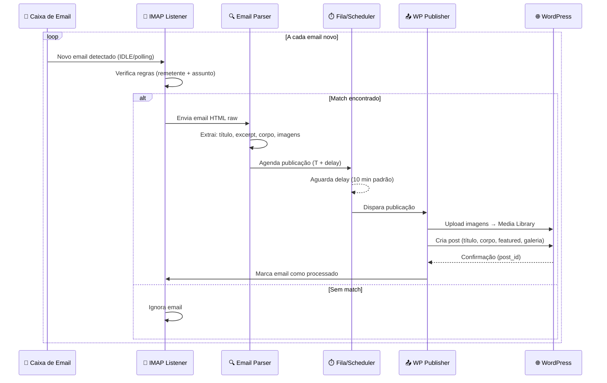

# 📧 Email Content Extractor — Planejamento

> **Projeto:** Ferramenta de extração automática de conteúdo de e-mail → WordPress  
> **Cliente:** Victor Samuel  
> **Status:** 🟢 Definido — Pronto para implementação  
> **Criado em:** 2026-05-11  
> **Atualizado em:** 2026-05-11  

---

## 1. Visão Geral

Sistema em Python que monitora caixas de e-mail IMAP, extrai conteúdo estruturado de newsletters/releases e publica automaticamente como posts no WordPress via REST API. Inclui painel administrativo web para configuração de regras de matching, sites destino e parâmetros de publicação.

---

## 2. Arquitetura Macro

```
┌─────────────────────────────────────────────────────────────┐
│                     PAINEL ADMIN (Web)                       │
│  - Cadastro de sites WordPress                              │
│  - Regras de matching (remetente / assunto / regex)         │
│  - Configuração de delay (padrão: 10 min)                   │
│  - Logs de publicações / erros                              │
│  - Status dos listeners                                     │
└──────────────────────────┬──────────────────────────────────┘
                           │ API REST
┌──────────────────────────▼──────────────────────────────────┐
│                   BACKEND PYTHON                             │
│                                                              │
│  ┌──────────────┐  ┌───────────────┐  ┌──────────────────┐  │
│  │ IMAP Listener│  │ Email Parser  │  │ WP Publisher     │  │
│  │ (polling /   │→ │ (HTML → blocos│→ │ (REST API /      │  │
│  │  IDLE push)  │  │  estruturados)│  │  Plugin bridge)  │  │
│  └──────────────┘  └───────────────┘  └──────────────────┘  │
│                                                              │
│  ┌──────────────┐  ┌───────────────┐                        │
│  │ Scheduler    │  │ Image Handler │                        │
│  │ (delay conf.)│  │ (download,    │                        │
│  │              │  │  upload media)│                        │
│  └──────────────┘  └───────────────┘                        │
└──────────────────────────┬──────────────────────────────────┘
                           │
              ┌────────────▼────────────┐
              │    WordPress Sites      │
              │  ┌────────┐ ┌────────┐  │
              │  │ Site A │ │ Site B │  │
              │  │+Plugin │ │+Plugin │  │
              │  └────────┘ └────────┘  │
              └─────────────────────────┘
```

---

## 3. Componentes Principais

### 3.1 IMAP Email Listener

| Item | Detalhe |
|------|---------|
| **Protocolo** | IMAP (SSL/TLS) |
| **Modo** | IMAP IDLE (push) com fallback para polling a cada 60s |
| **Filtro** | Remetente + padrão de assunto (configurável no painel) |
| **Multi-conta** | Suportar N contas de email monitoradas simultaneamente |
| **Marcação** | Marcar e-mail como lido + aplicar label/flag após processamento |

### 3.2 Email Parser (HTML → Blocos WordPress)

Baseado na análise do e-mail de exemplo (sistemas@comuniquese2.com.br):

#### Estrutura detectada do e-mail:
```
1. [IMAGEM DESTAQUE]  → Featured Image do post
2. [TÍTULO H1/H2]     → Título do post (extraído do assunto ou corpo)
3. [BLOCKQUOTE]        → Subtítulo / excerpt do post
4. [CONTEÚDO CORPO]   → Corpo do post (com formatação preservada)
5. [GALERIA IMAGENS]  → Galeria com lightbox no final
6. [ASSINATURA]       → DESCARTADO (não publicar)
```

#### Regras de conversão:
| Elemento no email | Saída WordPress |
|-------------------|-----------------|
| Primeira `` grande | Featured Image (imagem destacada) |
| `<h1>`, `<h2>`, `<h3>` | Mantém hierarquia de headings |
| `<strong>` / `<b>` em parágrafo isolado | Converte para `<h3>` |
| `<blockquote>` | Excerpt do post (subtítulo) |
| Parágrafos `<p>` | Mantém como `<p>` |
| Listas `<ul>`, `<ol>` | Mantém listas |
| `<em>` / `<i>` (itálico) | Mantém itálico |
| Links `<a>` | Mantém links |
| Imagens no final (grupo) | Galeria WordPress com lightbox |
| Assinatura / rodapé | **Remove automaticamente** |

### 3.3 Image Handler

- Download das imagens do e-mail (inline e anexos)
- Upload para a Media Library do WordPress via REST API
- Primeira imagem grande → `featured_media` do post
- Imagens finais → galeria agrupada
- Compressão/redimensionamento opcional antes do upload

### 3.4 WordPress Publisher

- Publicação via **WP REST API v2** (`/wp-json/wp/v2/posts`)
- Autenticação: Application Password ou JWT
- Upload de mídia: `/wp-json/wp/v2/media`
- Campos mapeados:

| Campo WP | Origem |
|----------|--------|
| `title` | Assunto do e-mail (limpo) |
| `content` | Corpo parseado em HTML |
| `excerpt` | Texto do blockquote |
| `featured_media` | ID da imagem destacada |
| `status` | `publish` (imediato) ou `draft` (revisão) |
| `categories` | Configurável no painel por regra |
| `tags` | Configurável no painel por regra |
| `date` | Data do e-mail + delay configurado |

### 3.5 Plugin WordPress (Bridge)

Plugin instalado em cada site WordPress para:

- Endpoint customizado de recebimento de posts (alternativa ao REST padrão)
- Template de galeria com **lightbox fullscreen**
- Shortcode `[email_gallery ids="1,2,3"]` renderizado com lightbox
- Webhook de confirmação (notifica o sistema que o post foi criado)
- Painel de configuração no wp-admin com token de autenticação

### 3.6 Scheduler / Delay

- Após detecção do e-mail, agenda publicação para `T + delay_minutos`
- Delay padrão: **10 minutos** (configurável por regra no painel)
- Fila de publicação com retry em caso de falha (3 tentativas, backoff exponencial)
- Possibilidade de cancelar publicação pendente via painel

### 3.7 Painel Admin (Web Dashboard)

#### Telas previstas:

| Tela | Funcionalidade |
|------|----------------|
| **Dashboard** | Resumo: posts publicados hoje, pendentes, erros |
| **Sites** | CRUD de sites WordPress (URL, credenciais, categorias) |
| **Contas de Email** | CRUD de contas IMAP monitoradas |
| **Regras** | Matching: remetente, padrão assunto, site destino, delay, categoria |
| **Fila** | Posts pendentes, agendados, em processamento |
| **Logs** | Histórico completo com preview do conteúdo extraído |
| **Configurações** | Delay global, intervalo de polling, notificações |

---

## 4. Stack Tecnológica (Confirmada)

| Camada | Tecnologia |
|--------|------------|
| **Backend** | Python 3.12+ com FastAPI |
| **Banco de dados** | PostgreSQL 15 Alpine (instância **dedicada/isolada**) |
| **Task Queue** | Celery + Redis Alpine (instância **dedicada/isolada**) |
| **Email** | Gmail IMAP (email pessoal) via `imapclient` + `email` stdlib |
| **HTML Parsing** | `BeautifulSoup4` + `lxml` |
| **WordPress API** | `httpx` (async HTTP client) |
| **Painel Admin** | **Next.js** (React SPA) |
| **Plugin WP** | PHP 8.x nativo WordPress (Classic Editor + galeria custom) |
| **Deploy** | Docker Compose (stack isolada com `container_name`) |
| **Lightbox** | GLightbox ou PhotoSwipe (no plugin WP) |
| **Notificações** | WhatsApp via **Evolution API** (instância já em produção) |
| **Sites WP** | 3 a 6 sites, Classic Editor, publish direto |

---

## 5. Fluxo de Operação



---

## 6. Regras de Matching (Detalhamento)

Cada regra no painel contém:

```yaml
regra:
  nome: "ExpoQueijo - Releases"
  ativo: true
  
  # Filtros (OR entre grupos, AND dentro do grupo)
  filtros:
    remetente_contem: "comuniquese2.com.br"
    remetente_nome: "ExpoQueijo Brasil"
    assunto_regex: "ExpoQueijo.*"  # opcional
  
  # Destino
  site_destino: "expoqueijobrasil.com.br"
  categoria_wp: "Notícias"
  tags_wp: ["release", "imprensa"]
  autor_wp: "admin"
  status_publicacao: "publish"  # publish | draft | pending
  
  # Timing
  delay_minutos: 10
  
  # Parsing
  remover_assinatura: true
  remover_rodape: true
  converter_bold_para_h3: true
  extrair_galeria: true
```

---

## 7. Detecção de Assinatura / Rodapé

Estratégia para **não publicar** conteúdo irrelevante:

1. Detectar padrões de assinatura (nome, cargo, telefone, email)
2. Identificar `<table>` com layout de assinatura
3. Detectar "Todos os direitos reservados", "©", endereço
4. Cortar conteúdo a partir do último bloco de imagens da galeria
5. Configurável por regra: regex ou seletor CSS de corte

---

## 8. Plugin WordPress — Funcionalidades

### 8.1 Galeria com Lightbox

```php
// Shortcode: [email_gallery ids="1,2,3" columns="3"]
// Renderiza grid de thumbnails
// Clique abre lightbox fullscreen (PhotoSwipe/GLightbox)
// Suporte a swipe no mobile
```

### 8.2 Endpoint de Recebimento

```
POST /wp-json/email-extractor/v1/publish
Authorization: Bearer <token_configurado>
Content-Type: application/json

{
  "title": "...",
  "content": "...",
  "excerpt": "...",
  "featured_image_url": "...",
  "gallery_images": ["url1", "url2", "url3"],
  "category": "Notícias",
  "tags": ["release"],
  "status": "publish"
}
```

### 8.3 Painel no wp-admin

- Token de autenticação (gerado automaticamente)
- Status de conexão com o sistema
- Últimos posts recebidos
- Configuração de template da galeria

---

## 9. Segurança

- [ ] Tokens de API armazenados com criptografia (Fernet/AES)
- [ ] Senhas IMAP criptografadas no banco
- [ ] HTTPS obrigatório para comunicação com WordPress
- [ ] Rate limiting no endpoint do plugin
- [ ] Validação de origem (IP whitelist ou HMAC signature)
- [ ] Logs de auditoria no painel

---

## 10. Estimativa de Esforço

| Fase | Tarefas | Estimativa |
|------|---------|------------|
| **1. Setup & Infra** | Docker, banco, estrutura FastAPI | 4h |
| **2. IMAP Listener** | Conexão, IDLE, polling, filtros | 6h |
| **3. Email Parser** | HTML parsing, extração de blocos, imagens | 8h |
| **4. WP Publisher** | Upload mídia, criação de post, galeria | 6h |
| **5. Scheduler** | Celery/Redis, delay, retry, fila | 4h |
| **6. Painel Admin** | Dashboard, CRUD sites/regras/contas | 12h |
| **7. Plugin WP** | Endpoint, galeria, lightbox, config | 8h |
| **8. Testes & Polish** | Testes E2E, edge cases, documentação | 6h |
| **TOTAL** | | **~54h** |

---

## 11. Estrutura de Diretórios (Proposta)

```
email/
├── docker-compose.yml
├── .env
├── backend/
│   ├── app/
│   │   ├── main.py                 # FastAPI app
│   │   ├── config.py               # Settings (Pydantic)
│   │   ├── database/
│   │   │   ├── models.py           # SQLAlchemy models
│   │   │   ├── migrations/         # Alembic
│   │   │   └── connection.py
│   │   ├── services/
│   │   │   ├── imap_listener.py    # IMAP IDLE + polling
│   │   │   ├── email_parser.py     # HTML → blocos estruturados
│   │   │   ├── image_handler.py    # Download/upload imagens
│   │   │   ├── wp_publisher.py     # WordPress REST API client
│   │   │   └── scheduler.py        # Agendamento com delay
│   │   ├── api/
│   │   │   ├── routes/
│   │   │   │   ├── sites.py
│   │   │   │   ├── rules.py
│   │   │   │   ├── accounts.py
│   │   │   │   ├── queue.py
│   │   │   │   └── logs.py
│   │   │   └── deps.py
│   │   └── workers/
│   │       └── celery_app.py       # Celery workers
│   ├── requirements.txt
│   └── Dockerfile
├── frontend/                       # Painel Admin
│   ├── src/
│   └── package.json
├── wordpress-plugin/
│   ├── email-extractor/
│   │   ├── email-extractor.php     # Main plugin file
│   │   ├── includes/
│   │   │   ├── class-api.php       # REST endpoint
│   │   │   ├── class-gallery.php   # Shortcode + lightbox
│   │   │   └── class-settings.php  # Admin settings
│   │   └── assets/
│   │       ├── css/
│   │       └── js/                 # GLightbox/PhotoSwipe
│   └── README.md
└── docs/
    └── planejamento-email-extractor.md  # Este arquivo
```

---

## ✅ 12. DECISÕES CONFIRMADAS

| # | Pergunta | Resposta |
|---|----------|----------|
| P1 | Provedor de e-mail | **Gmail** (IMAP SSL) |
| P2 | Tipo de e-mail | **Pessoal** — requer filtragem cuidadosa por remetente/assunto |
| P3 | Quantos sites WP | **3 a 6** sites conectados |
| P4 | Editor WP | **Classic Editor** + Elementor quando precisar de galeria |
| P5 | Status do post | **Publicado direto** (`status: publish`) |
| P6 | Padrão dos e-mails | **Mesmo padrão** para todos (imagem → título → blockquote → corpo → galeria) |
| P7 | Versão | **Completa com painel** (não MVP) |
| P8 | Painel Admin | **Next.js** (React SPA) |
| P9 | Notificações | **WhatsApp** via Evolution API |
| P10 | Infra | Stack **Docker isolada** (PostgreSQL + Redis dedicados) |

### Notas importantes das decisões:

- **Gmail IMAP:** Requer App Password (2FA) ou OAuth2. IMAP IDLE é suportado. Limite de 15 conexões simultâneas.
- **Email pessoal:** O listener **DEVE** filtrar rigorosamente por remetente + padrão de assunto para não capturar emails irrelevantes.
- **Classic Editor:** Conteúdo será enviado como HTML puro (sem blocos Gutenberg). Galeria será via shortcode/plugin customizado com lightbox.
- **Evolution API:** Integração via endpoint `https://evolutionapi.victorsamuel.com.br` com API key existente.

---

## 13. Arquivos de Infraestrutura

| Arquivo | Propósito |
|---------|----------|
| `docker-compose.yml` | Stack de **produção** (PostgreSQL, Redis, Backend, Frontend, Celery Worker) |
| `docker-compose.local.yml` | Stack de **desenvolvimento local** (mesmos serviços, ports expostas, volumes bind) |
| `.env.example` | Template de variáveis de ambiente |
| `TODO.md` | Checklist de implementação com status |

---

## 14. Próximos Passos

1. ✅ ~~Definir escopo e decisões~~ — Concluído
2. ✅ ~~Criar docker-compose.yml (prod + local)~~ — Concluído
3. ✅ ~~Criar TODO.md~~ — Concluído
4. 🔜 Implementar setup inicial do backend (FastAPI + modelos)
5. 🔜 Implementar IMAP Listener com Gmail
6. 🔜 Implementar Email Parser
7. 🔜 Implementar WP Publisher
8. 🔜 Criar Painel Admin Next.js
9. 🔜 Criar Plugin WordPress
